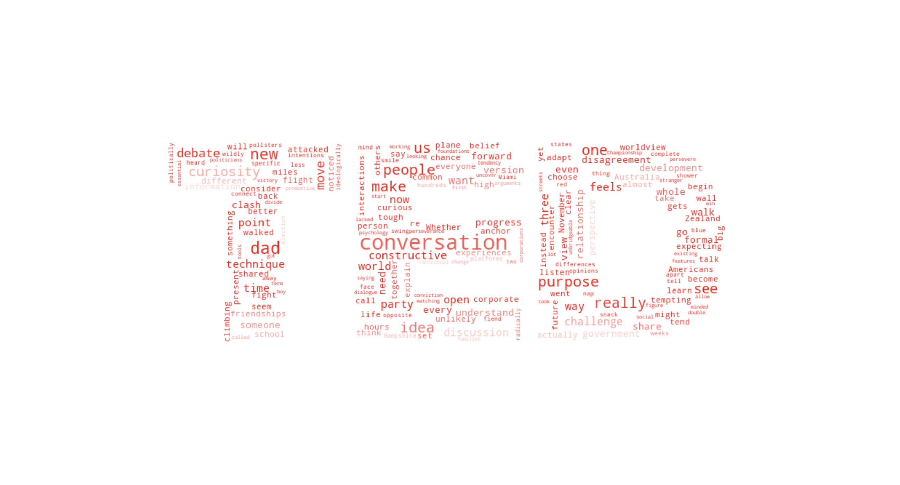

# Scraping TED Talks' transcript
Scraping the transcript of TED Talks from [www.ted.com/talks](https://www.ted.com/talks/julia_dhar_how_to_have_constructive_conversations/transcript?trk=public_post-text) and visualizing relationships.

## Table of Contents
* [General Info](#general-information)
* [Libraries Used](#libraries-used)
* [Improvements](#improvements)
* [Screenshots](#screenshots)
* [Setup](#setup)
* [Project Status](#project-status)

## General Information
Many times you might have seen a cloud filled with lots of words in different sizes, which represent the frequency or the importance of each word. This is called Tag Cloud or WordCloud. *[Source: DataCamp]*  
In this project, we make a WordCloud from the transcript scraped to get an idea of what the speaker talked about.
## Libraries Used
- lxml - version 4.9.1
- beautifulsoup4 - version 4.11.1
- requests - version 2.28.1
- selenium - version 4.5.0
- wordcloud - version 1.8.2.2
- numpy - version 1.23.3
- matplotlib - version 3.6.1

## Improvements
This project is using Selenium for browser automation to click on "Read transcript" button to make the transcript visible for scraping.  
It will click the button and give the modified page to beautifulsoup for scraping.

## Screenshots

## Setup
Requirents for this project are the libraries listed above.  
To install these libraries to your local environment run the following installation commands in you terminal;
- `pip3 install lxml`
- `pip3 install beautifulsoup4`
- `pip3 install requests`
- `pip3 install selenium`
- `pip3 install wordcloud`
- `pip3 install numpy`
- `pip3 install matplotlib`

## Project Status
Project is: _in progress_  